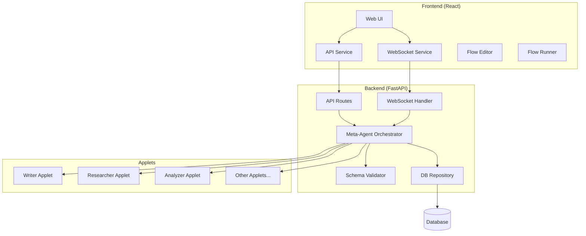
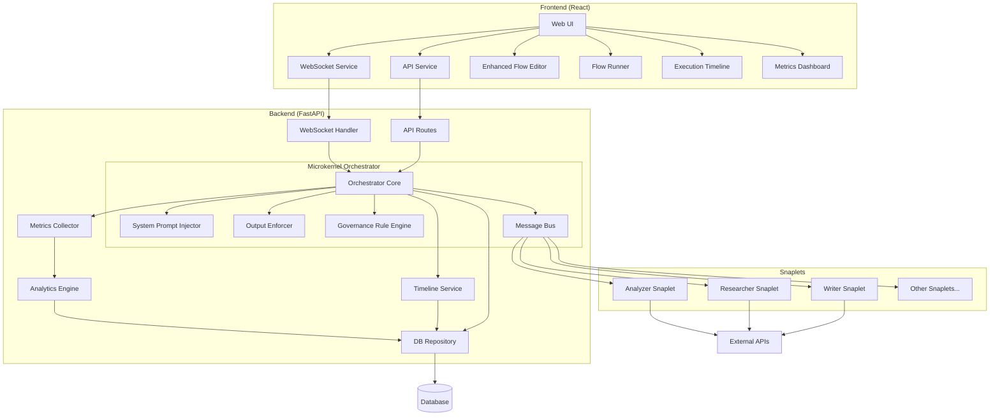

# SynApps Architecture Diagram

## Current Architecture

## Enhanced Architecture

## Key Enhancements

1. **Microkernel Orchestrator**:
   - Lightweight core with modular components
   - System Prompt Injector for standardized agent instructions
   - Output Enforcer for structured response validation
   - Governance Rule Engine for compliance and safety

2. **Message Bus**:
   - Direct agent-to-agent communication
   - Event-driven architecture
   - Asynchronous message passing

3. **Enhanced Monitoring**:
   - Metrics Collector for performance tracking
   - Analytics Engine for insights
   - Timeline Service for execution history and playback

4. **Improved Frontend**:
   - Enhanced Flow Editor with advanced node types
   - Execution Timeline visualization
   - Metrics Dashboard for monitoring

5. **Standardized Snaplet Interface**:
   - Consistent API for all AI agents
   - Pluggable architecture
   - Support for parallel execution and conditional branching
