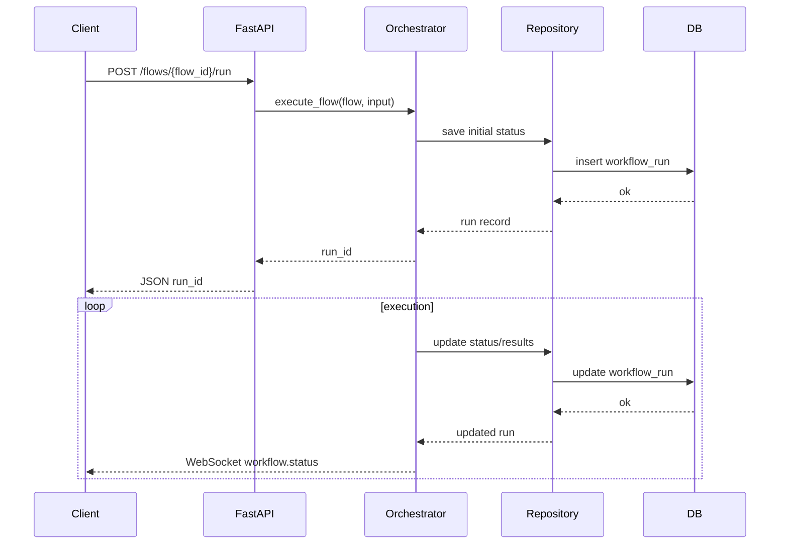

# Request Flow

This document describes how a request travels from the client to the database when executing a workflow. The flow is based on the `/flows/{flow_id}/run` endpoint implemented in the orchestrator.

## Steps
1. **Client Request** – The frontend sends a `POST` request to `/flows/{flow_id}/run` with the input payload.
2. **FastAPI Endpoint** – The request is handled by `run_flow` in `apps/orchestrator/main.py`. It loads the flow from the `FlowRepository` and invokes `Orchestrator.execute_flow`.
3. **Orchestrator** – `execute_flow` creates a `WorkflowRunStatus`, saves it using `WorkflowRunRepository`, and launches `_execute_flow_async` to process each applet in the background.
4. **Repository Layer** – `WorkflowRunRepository` opens an async session via `get_async_session` and persists the run status using SQLAlchemy ORM models defined in `models.py`.
5. **Database** – The session commits the changes to the configured database (SQLite by default). Subsequent progress updates repeat this repository step.
6. **WebSocket Updates** – As the flow executes, status updates are broadcast to connected clients via the `/ws` WebSocket endpoint.

## Sequence Diagram

